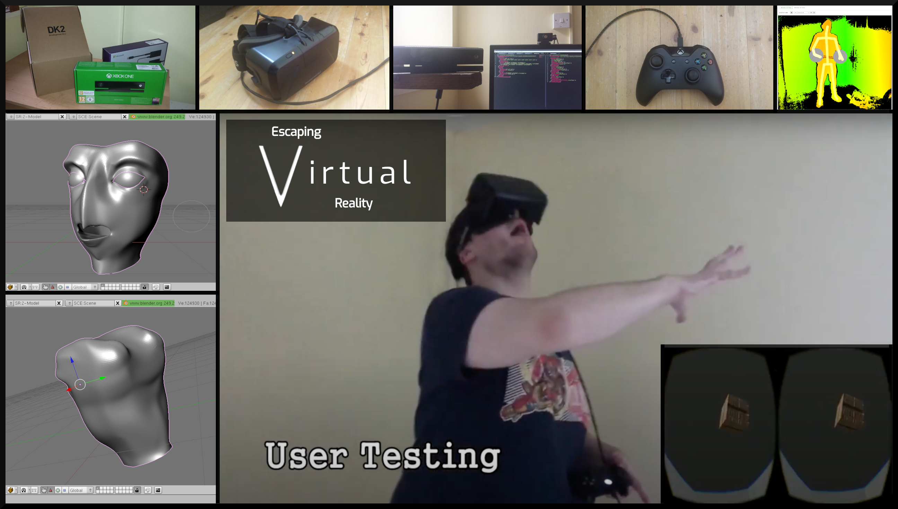

# Escaping Virtual Reality

## Introduction

Escaping Virtual Reality a 3D Virtual Reality game, built using the Unity Game Engine, utilising an Oculus Rift DK2 Headset, Kinect 2.0, and an Xbox game controller as input devices.

 - [Software Development, Human Computer Interaction, Game Design & Virtual Reality]

## Overview

For my final year undergraduate project, I designed and developed a 3D game using the Unity game engine — a Virtual Reality puzzle solving experience. I utilised Microsoft’s Kinect and an Oculus Rift headset, combined with a gamepad for finer input, to immerse the player in an interactive virtual environment where the player’s movements were mirrored by their avatar. This project focused on the discovery and testing of new interaction models for novel and emerging hardware. I presented a demonstration consisting of a user testing sandbox and two game levels. I used an open source library to coordinate communication between the devices and customized the codebase to incorporate 3 methods of input. All scripting was implemented in C# and for 3D modelling I used a combination of free assets and models that I built using Blender. Each environment and game level had its own immersive backing track, which I wrote and produced for the demonstration.

Examination and demonstration was conducted in May 2016.

## Blog

Link to project blog - https://escapingvirtualreality.wordpress.com/